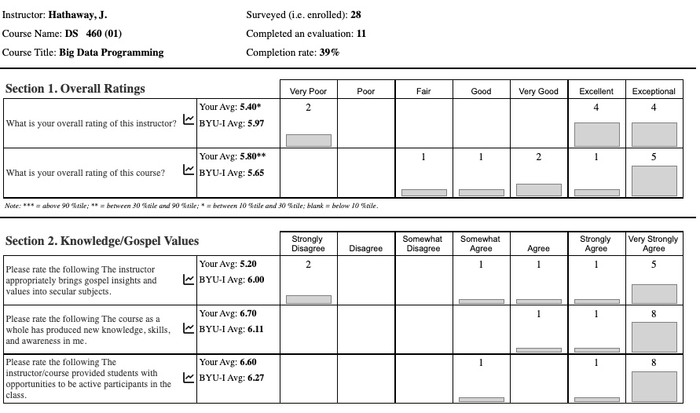

# Course Paradigm

I love and honor the experiences we can have working in industry. Your college education should mimic industry not high-school. With that in mind a few learning paradigms should be highlighted.

## Learning should 'burn' a little. Yes confusion is a good thing.

> The concept of optimal confusion is key to understanding why confusion is good for us and why its categorized as an epistemic emotion (an emotion critical to knowledge acquisition and learning). Confusion, like many uncomfortable things in life, is vital for learning. Confusion has the potential to motivate, lead to deep learning, and trigger problem solving. A study led by Sidney D’Mello found that when were trying to work through our confusion, we need to stop and think, engage in careful deliberation, develop a solution, and revise how we approach the next problem.

__[See short post for reference](https://educate.datathink.io/posts/desirable-difficulty/)__

[Annie Murphy Paul describes it this way](https://spencerauthor.com/why-confusion-leads-to-increased-engagement/):

> We short-circuit this process of subconscious learning, however, when we rush in too soon with an answer. It’s better to allow that confused, confounded feeling to last a little longer—for two reasons. First, not knowing the single correct way to resolve a problem allows us to explore a wide variety of potential explanations, thereby giving us a deeper and broader sense of the issues involved. Second, the feeling of being confused, of not knowing what’s up, creates a powerful drive to figure it out. We’re motivated to look more deeply, search more vigorously for a solution, and in so doing we see and understand things we would not have, had we simply been handed the answer at the outset.

Let's watch [this video](https://youtu.be/eVtCO84MDj8?si=gp9EmnNb550J5uuZ&t=271)

> The earth doesn't take one day to get around the sun. It takes a year.

## Wisdom Teaching

> If knowing well, sometimes gently and sometimes harshly, (trans)forms us through - and even at times into - itself, it is indeed true that knowledge cannot be directed other than toward wisdom or folly. … The knowledge of which we speak here is … what remains in the soul after observation is complete. … These insights nourish and expand us for good or ill. Not merely self-conscious learning, but even information-gathering may have its way with us.

> It is an inadequate argument that sets forth an understanding of knowledge as one in which either knowledge passes through the knower, leaving no trace, or that knowledge is “out there,” merely revealed or disclosed or located by the knower. Rather, strong knowing is a dynamic and interactive process in which both the known and the knower are constantly shaping each other. … Knowing is a spiritual craft or art by means of which the soul grows by God’s grace.

> They try to shortcut a process that is not simplifiable, because knowing God, like knowing how to make a medical diagnosis, requires not simply "having” information but being in a sufficiently fluent relationship with that information to be able to use it skillfully. The self matures in the process.

> __Ellen T. Charry__ ‘Walking in Truth: On Knowing God’from the book titled But is it all true? The Bible and the question of truth. 

## Wisdom through Tacit Knowledge

> [Tacit knowledge](https://en.wikipedia.org/wiki/Tacit_knowledge) incorporates so much embedded learning that its rules may be impossible to separate, thus it is almost impossible to reproduce in a document or database. That is, tacit knowledge commonly cannot be spoken but rather demonstrated and imitated (Personal Knowledge: Polanyi, 1966).

### Did Jesus learn by tacit knowledge?

John 5 provides a narrative of a conflict between Jesus and the Jewish leadership on Sabbath day activities. It is interesting that Jesus does not attempt to quote scripture to justify his behavior. Neither, does he build a strong logical argument using jointly believed assumptions. In verse 19, he simply states,

> The Son can do nothing of himself, but what he seeth the Father do: for what things soever he doeth, these also doeth the Son likewise.

### Ok, can we get a more concrete example?

> Another example. Someone who tries to find his way in complete darkness for the first time with a stick, feels the impact of the stick in his palm and fingers and hasn’t got the least idea what the stick is touching. Only after a lot of practice is this sensation in the palm of the hand transformed into a feeling for what the point of the exploring stick is touching. So, in the beginning of this learning process our attention is focused on the sensations in our hand. At the end of this process our attention has shifted to the objects the stick touches. We feel - or see, if you like - the slippery rock, the furry dog, the threshold … The sensations in our hand and precisely how they tell us something about the objects we meet, however, remain tacit. We decode, as it were, tacitly the sensations in our hand into three dimensional objects.

> In this way the stick becomes something from which our attention proceeds, and not something which attracts our attention. “we incorporate it in our body - or extend our body to include it - so that we come to dwell in it”. 

[Walter Van Herck (*The Tacit Dimension*)](https://www.bu.edu/wcp/Papers/Reli/ReliVanh.htm)

## Student Feedback (with my commentary)

### Student 1

> One thing that was really hard was the total blindness I felt almost the entire semester. I get that that was kind of the point, but it really was hitting a brick wall all semester. I think it affected everyone in the class's hours in one of two ways: either they felt totally lost so didn't put in any hours, or they felt like they had to work extra hard to make any progress at all and went way overboard. I'm in the latter category. I think making the end goal a little less foggy earlier would be a good thing for everyone. __Spring 2022 Student__

- __Fantastic comments:__ _The feeling described is what we need to get comfortable experiencing. Open-ended problems have this issue. Remember, the class decides the end goal. Not me._

> I didn't appreciate working for hours on something, and then having the direction of the class upended on me, rendering all my work useless. It was frustrating and discouraged me from working on things until the last second in case they were changed on me at the last second. __Spring 2022 Student__

- __My response:__ _This element was a crucial part of the class. You should have had enough space to make your ideas what we used as a class. Make sure to take the time to build your communication so we all see how your vision is optimal._

> My favorite part about the course was the design thinking principles that were implemented that allowed us as a class to decide what we wanted to learn. I also really enjoyed the final, specifically learning how to use GraphQL API. I also enjoyed learning about spark and to have an opportunity to practice my Scala skills. At times the class was confusing with deadlines and expectations of the class. For me, that is what I disliked the most about the class was the occasional confusion with expectations. __Spring 2022 Student__

- __I know:__ _Seeing a theme in the above three. The class is a work in progress. We continue to find the balance between teacher skills, student skills, and how far we can push the start-up analogy into a three-month classroom setting._

> Something I enjoyed about the class was how open-ended the course was. I think this allowed for greater collaboration that cannot be accomplished in the traditional sit and lecture format. __Spring 2022 Student__

- __Remember:__ _Your class defines the project vision. As the teacher, I have some technical learning objectives we need to complete. Collaboration and communication are key learning outcomes._

> Overall, I enjoyed the class. I liked that the solution changed over time (I feel like that reflects how problem-solving usually goes), and that we learned more than PySpark (i.e., Streamlit, docker, etc.). I enjoyed the free flow of the class and the freedom to express thoughts and ideas. I think that the course would benefit from a little more structure when learning technical skills. __Spring 2022 Student__

- __Agreed:__ We continue to improve the structure around the technical skills. However, we are pushing the boundaries on this topic as well. We invite you to think of your instructor as an expensive consultant ($300-$500 an hour) that you want to leverage on elements of the programming that you can't quite figure out on your own.

### Student 2

> I think the intentional lack of rigid structure is a great mechanism for growth. I personally feel much more prepared for a real work environment after this class than any other class. Students who find this type of class frustrating seem to be the same students who would find dynamic work environments frustrating and should probably find a job where they are just told what to do and not have to worry about the independence and agency as much. __Winter 2022__

- __Agreed:__ This student took control of their learning experience.  Please note that the class sets the direction in consultation with me.  I want you to feel what it means to have independence and agency with high expectations.

### Student 3

> Brother Hathaway is the WORST professor Ive ever had. Each class he would tell us, figure it out. The more advanced students would and then he would yell at the rest of the class calling us failures because we aren't as advanced as the #1 student. To top it all off, he didn't teach. He had us do it, then gets mad when we don’t completely understand.

- __Life is a journey:__ Well, 'WORST' is pretty intense. I think this student was actually an advanced student. At least he earned an A. He and his team earned my negative attention because of their work not because of other student's work. This class is built for the 'teacher' to work as a manager and mentor. It is worth reviewing the difference between mentors and teachers as [described here](https://mentorcruise.com/blog/whats-difference-between-teacher-vs-mentor/#:~:text=A%20teacher%20provides%20knowledge%20and,guide%20you%20through%20your%20vision.). 
    - _"Mentorships are based on a mentor’s effective guidance of the mentee’s growth, whether professional or personal. As such, this is hard to quantify and is largely based on how the mentee decides to proceed following the mentor’s advice. On the other hand, a teacher instructs you on a subject matter based on a set of predefined criteria. Most of the time, the main goal of a teacher is to make sure that their students get great grades."_
    - _"The mentor wills the mentee to self-discipline. The teacher instills learning through authority."_

### Student 4 (While in their internship after the class)

> Hey Bro. Hathaway. Just want to say I learned a ton from your class last semester that I am now using at my internship in data engineering at XXXXX.

- __Mimicking:__ I am doing all I can to mimic work not school. I would love to hear from many of you about how this class supported you while in the workforce.

### Student 5 (While taking the class)

> Brother Hathaway knows an incredible amount about the field. However, he is blatantly disrespectful to students, teaches false doctrine based on opinions, and acts as if he is the leading expert on every subject. If you try to question or challenge him he will ridicule you in front of the class rather than try to teach you in a dignified manner. __Fall 2022 Student__

- __Apology:__ I never want to be perceived as one that ridicules. If you feel this way, please come talk to me one-on-one. I also don't want to be disrespectful. However, I do have very high expectations and will communicate shortcomings.
- __Leading Expert:__ I don't think I am a leading expert on many subjects. I do have a lot of weakly held strong beliefs. Especially if I have experience in the space. I think this student got a little frustrated one day in class when we were talking about dieting. He was the thin one and I was the fat one. Maybe he was right.
- __False Doctrine:__ I found this comment amusing. I have made a concerted effort to share my faith in the first 5-10 minutes of class over the last few semesters. I enjoy the banter with you as we talk about more complicated elements of our theology. I know they are my beliefs and that I don't speak for the church. I hope you can at least think with me about the depth of our wonderful theology and how our Sunday School answers sometimes miss the mark.

For reference you can see the scoring of my Fall 2022 course (I bet the above review was from one of those two `Very Poor` and `Strongly Disagree` students).

### Two FA23 Students

|                    | FA23 Student 1                                               | FA23 Student 2                                               |
| ------------------ | ------------------------------------------------------------ | ------------------------------------------------------------ |
| Teaching  ability  | I feel like I wasted this semester in the class since I now know that I will likely never use or need any of the skills I was taught in this class. | Most professors at BYUI are great people and good teachers. I would say Brother Hathaway is the exception in that he is a good person and an even better teacher. |
| Like Industry      | I don’t know if I am lucky because I have a job in the field and this is not remotely close to how projects are ran. I feel very sorry for you if how this class ran is what your experience has been in the field. | First of all, this was a great class. I’m a big believer that this is closer to how the real world works compared to most classes. |
| Topics covered     | As a last note, I have spoke with many senior data scientists at my workplace and they told me that the only places they have ever seen tools similar to the ones we learned in class were at FANG companies. They told me that I would almost never need to know anything more than pandas. | Most people would complain that the class was too challenging — I would argue it wasn’t challenging enough. Tracking your hours really helps you realize how much time you should be spending on the class. Most importantly, I learned a ton and feel way better equipped for my future career. |
| Class organization | All I can say that I got from this class was anxiety stress, and had to return to therapy.  I sincerely hope that you improve this class to be an environment that students can feel safe and encouraged to learn in a way that is not fueled by fear or stress. | Tracking your hours really helps you realize how much time you should be spending on the class. Towards the middle of the semester, I was having trouble getting my hours in. So, I would have appreciated more projects/assignments that would’ve helped me get those hours in. It’s easiest for me to learn when I’m applying skills in projects, not just ‘learning’ through watching YouTube, etc. |
| Grading            |                                                              | Re-grading seems similar to the grace and repentance the Savior offers and I think it’s awesome that Brother Hathaway offers it. |

### Student 8 (Upon Completing the course)

> This class is very demanding but rewarding at the same time. I've learned so much about dealing with big data from getting, wrangling, visualizing data, and using data to make decisions.

- __This is a data science course:__ _Using data to make decisions is the goal. If you leave saying that you learned this, I have done my job._

> My biggest takeaway is that to learn or be good at something, pain is inevitable but the result is satisfying after you put in the work. I walked out of this class feeling like I am now capable of learning a new programming language on my own with resources found online. 

- __Fantastic comments:__ _I want you to know that you can be a lifelong learner and that you do not need teachers or academia to pick up skills._

> Also, don't let Brother Hathaway scare you. He seems harsh and might yell at you but he truly cares and loves his students. Don't be afraid to ask questions. 

- __On Being Scary:__ _I do care for each of you. Most importantly, I care for the future you. At times, I let my care for the future you have much more weight than the current you._

> If you don't ask for help, you might fail this class!

- __Can we hear and Amen?:__ _This class runs open-ended. Please don't be afraid to ask questions to gain clarity. Even if you are worried about the response, you have to ask questions to move forward._

